# Part 1: Intro to R and RStudio

### Learning Objectives

-   Describe what R and RStudio are.
-   Interact with R using RStudio.
-   Familiarize various components of RStudio.
-   Employ variables in R.

## What is R?

The common misconception is that R is a programming language but in fact
it is much more than that. Think of R as an environment for statistical
computing and graphics, which brings together a number of features to
provide powerful functionality.

The R environment combines:

-   Effective handling of big data
-   Collection of integrated tools
-   Graphical facilities
-   Simple and effective programming language

### Why use R?

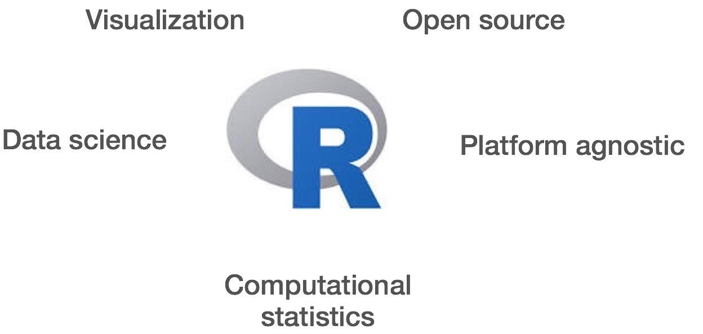

R is a powerful, extensible environment. It has a wide range of
statistics and general data analysis and visualization capabilities.

-   Data handling, wrangling, and storage
-   Wide array of statistical methods and graphical techniques available
-   Easy to install on any platform and use (and it's free!)
-   Open source with a large and growing community of peers

#### Examples of R used in the media and science

-   *"At the BBC data team, we have developed an R package and an R
    cookbook to make the process of creating publication-ready graphics
    in our in-house style..."* - [BBC Visual and Data Journalism
    cookbook for R graphics](https://bbc.github.io/rcookbook/)
-   *"R package of data and code behind the stories and interactives at
    FiveThirtyEight.com, a data-driven journalism website founded by
    Nate Silver (initially began as a polling aggregation site, but now
    covers politics, sports, science and pop culture) and owned by
    ESPN..."* - [fivethirtyeight
    Package](https://cran.r-project.org/web/packages/fivethirtyeight/vignettes/fivethirtyeight.html)
-   [Single Cell RNA-seq Data analysis with
    Seurat](https://satijalab.org/seurat/)

## What is RStudio?

RStudio is freely available open-source Integrated Development
Environment (IDE). RStudio provides an environment with many features to
make using R easier and is a great alternative to working on R in the
terminal.


-   Graphical user interface, not just a command prompt
-   Great learning tool
-   Free for academic use
-   Platform agnostic
-   Open source

::::: panel-tabset
# Create a new project directory in Local RStudio

Let's create a new project directory for our "Introduction to R" lesson
today.

1.  Open RStudio
2.  Go to the `File` menu and select `New Project`.
3.  In the `New Project` window, choose `New Directory`. Then, choose
    `New Project`. Name your new directory `Intro-to-R` and then "Create
    the project as subdirectory of:" the Desktop (or location of your
    choice).
4.  Click on `Create Project`.

<!-- -->

5.  After your project is completed, if the project does not
    automatically open in RStudio, then go to the `File` menu, select
    `Open Project`, and choose `Intro-to-R.Rproj`.
6.  When RStudio opens, you will see three panels in the window.
7.  Go to the `File` menu and select `New File`, and select `R Script`.
8.  Go to the `File` menu and select `Save As...`, type `Intro-to-R.R`
    and select `Save`

The RStudio interface should now look like the screenshot below.

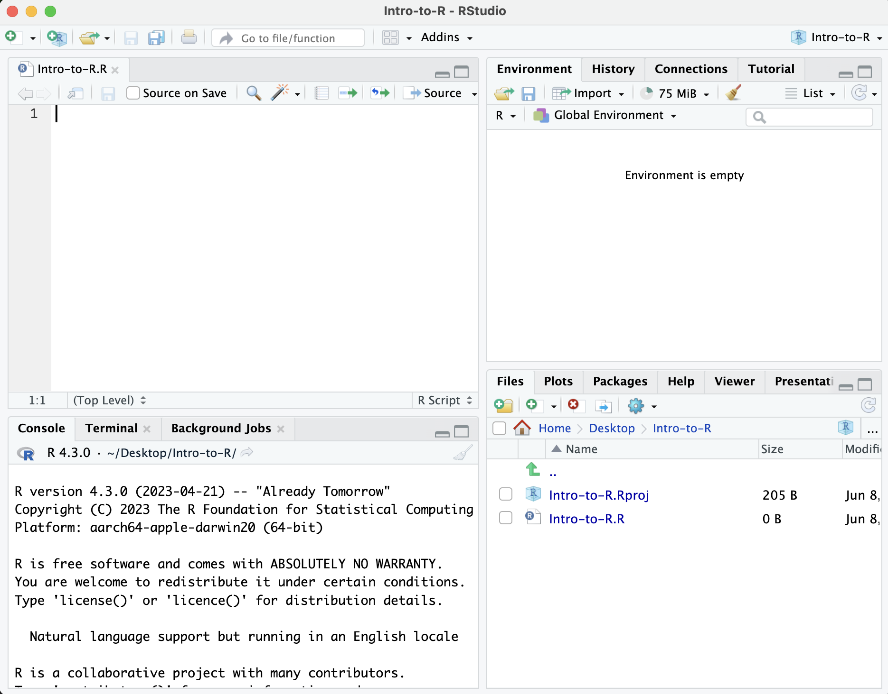{width="686"}

### What is a project in RStudio?

It is simply a directory that contains everything related your analyses
for a specific project. RStudio projects are useful when you are working
on context- specific analyses and you wish to keep them separate. When
creating a project in RStudio you associate it with a working directory
of your choice (either an existing one, or a new one). A `. RProj file`
is created within that directory and that keeps track of your command
history and variables in the environment. The `. RProj file` can be used
to open the project in its current state but at a later date.

When a project is **(re) opened** within RStudio the following actions
are taken:

-   A new R session (process) is started
-   The .RData file in the project's main directory is loaded,
    populating the environment with any objects that were present when
    the project was closed.
-   The .Rhistory file in the project's main directory is loaded into
    the RStudio History pane (and used for Console Up/Down arrow command
    history).
-   The current working directory is set to the project directory.
-   Previously edited source documents are restored into editor tabs
-   Other RStudio settings (e.g. active tabs, splitter positions, etc.)
    are restored to where they were the last time the project was
    closed.

*Information adapted from [RStudio Support
Site](https://support.rstudio.com/hc/en-us/articles/200526207-Using-Projects)*

## Adding directories

In order to add a directory, or folder, within your RStudio project, you
can click the "Create a new folder" button at the top-left of the
**Files/Plots/Packages/Help** window. It looks like a folder with a plus
sign on top of it. Let's name the directory `scripts` and click "OK".

Next, we are going to add the `data` directory:

1.  This directory can be downloaded from
    [here](https://www.dropbox.com/scl/fi/yszqm3ri6p4uf5ppuflp1/data.zip?rlkey=c496frt1ioud8rrbo9ea1614p&st=fw7fhif8&dl=1).
    Right-click on this link and select "Save Link As...".
2.  Navigate to your RStudio project and save the file.
3.  Go to the file in your file browser and double-click on the
    `data.zip` file to uncompress it.

::: callout-note
Windows users will need to check that within the `data` folder, there
isn't a second `data` directory within the `data` directory. If there
is, bring the nested `data` directory out of the `data` directory and
place it directly within your RStudio project.
:::

The RStudio interface should now look like this:

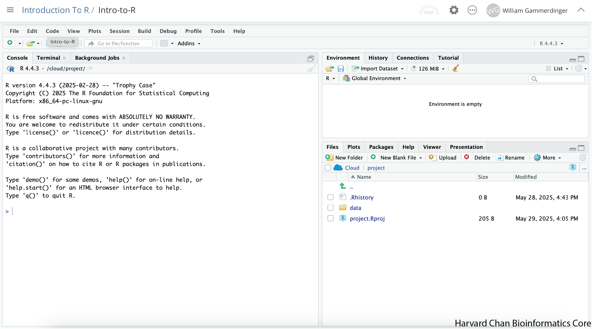

Next, we are going to create an Rscript to keep a record of our work,
but first we will implement **good data management practices** and
create a folder to hold this script. In the bottom-right panel there
should be a button that has a folder with a green plus on it and says
"New Folder", click this button:

::: callout-note
Depending on the size of your window, the "New Folder" button may just
have the icon or the icon and the word "Folder".
:::

A window should pop-up prompting you to provide a name for the folder.
Type "scripts" into the text box and click "OK":

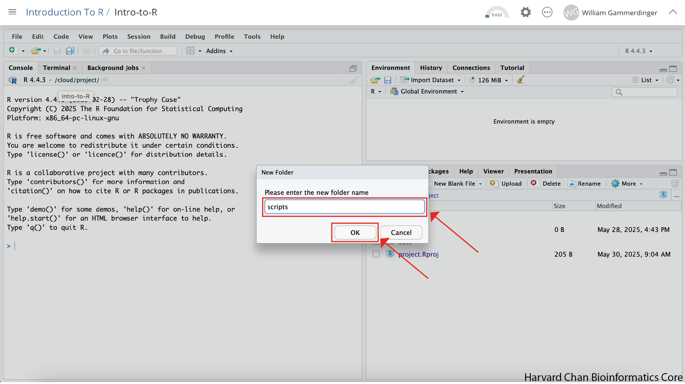

Now in the bottom-left panel, you will see a "scripts" folder.

Next, we will **create the Rscript** that we will write our code in. In
order to create an Rscript, click on the "File" menu option in the
top-left, then "New File" and then select "R Script".

This will create an R Script as the top panel on the left side of your
RStudio window.

Before we go any further, let's **save our new R Script** by following
the steps listed below:

1.  Click on the "File" menu option in the top-left and find "Save
    As...".
2.  You will see a finder window pop-up showng you working directory.
    Click the "scripts" folder.
3.  Let's name our R Script as "Intro-to-R.R" in the text field and
    click on the "Save" button
:::::

## RStudio Interface

**The RStudio interface has four main panels:**

1.  **Console**: This is where you can type commands and see output.
    *The console is all you would see if you ran R in the command line
    without RStudio.*
2.  **Script editor**: This is where you can type out commands and save
    to file. You can also submit the commands to run in the console.
3.  **Environment/History**: Environment shows all active objects and
    history keeps track of all commands run in console
4.  **Files/Plots/Packages/Help**: "Files" shows a file browser and
    "Plots" will populate when you create a plot. "Packages" will help
    you manage packages from CRAN and Bioconductor. "Help" holds manuals
    to the functions within R.

### Organizing your working directory & setting up

### Viewing your working directory

Before we organize our working directory, let's check to see where our
current working directory is located by typing into the console:

```{r}
#| label: getwd
#| eval: false
getwd()
```

Your working directory should be the folder where the R project is
located on your computer. The working directory is where RStudio will
automatically look for any files you bring in and where it will
automatically save any files you create, unless otherwise specified.

You can visualize your working directory by selecting the `Files` tab
from the **Files/Plots/Packages/Help** window.

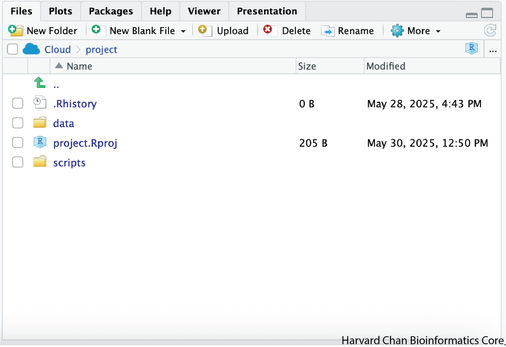

If you wanted to choose a different directory to be your working
directory, you could navigate to a different folder in the `Files` tab,
then, click on the `More` dropdown menu which appears as a Cog and
select `Set As Working Directory`.

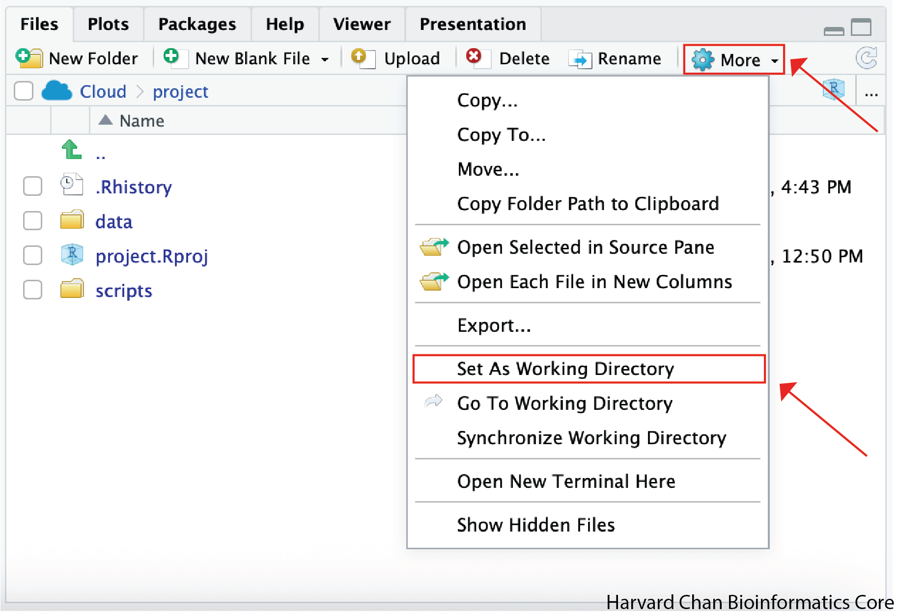

::: callout-tip
## **Exercise 1**

To organize your working directory for a particular analysis, you should
separate the original data (raw data) from intermediate datasets. For
instance, you may want to create a `data/` directory within your working
directory that stores the raw data, a `scripts/` directory for your R
scripts, a `results/` directory for intermediate datasets and a
`figures/` directory for the plots you will generate.

We have provided you with R project containing the `data/` directory and
we made our `scripts/` directory together. For this exercise create the
`results/` and `figures/` directories.

When finished, your working directory should look like this:

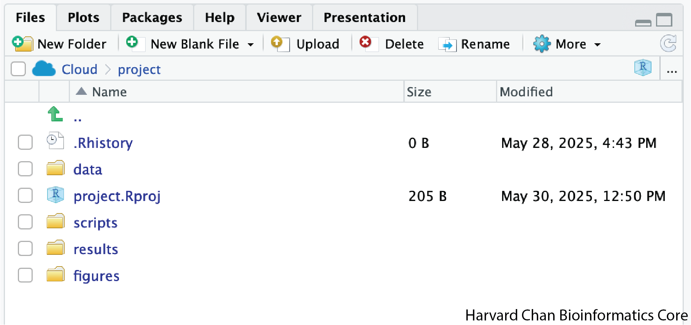
:::

### Setting up

This is more of a housekeeping task. We will be writing long lines of
code in our script editor and want to make sure that the lines "wrap"
and you don't have to scroll back and forth to look at your long line of
code.

Click on "Code" at the top of your RStudio screen and left-click "Soft
Wrap Long Lines" in the pull down menu.

## Interacting with R

Now that we have our interface and directory structure set up, let's
start playing with R! There are **two main ways** of interacting with R
in RStudio: using the **console** or by using **script editor** (plain
text files that contain your code).

### Console window

The **console window** (in RStudio, the bottom left panel) is the place
where R is waiting for you to tell it what to do, and where it will show
the results of a command. You can type commands directly into the
console, but they will be forgotten when you close the session.

Let's test it out:

```{r}
#| label: add_numbers
3 + 5
```

### Script editor

A better practice is to enter the commands in the **script editor** and
save the script. You are encouraged to comment liberally to describe the
commands you are running using `#`. This way, you have a complete record
of what you did, you can easily show others how you did it and you can
do it again later on if needed.

**The Rstudio script editor allows you to 'send' the current line or the
currently highlighted text to the R console by clicking on the `Run`
button in the upper-right hand corner of the script editor**.

Now let's try entering commands to the **script editor** and using the
comments character `#` to add descriptions and highlighting the text to
run:

```{r}
#| label: start_script
# Intro to R Lesson
# February 24th, 2026

# Interacting with R

# Add 3 and 5
3 + 5
```

Alternatively, you can send code to the console from the script editor
to be run by pressing the `Ctrl` and `Return/Enter` keys at the same
time as a shortcut.

You should see the command run in the console and output the result.

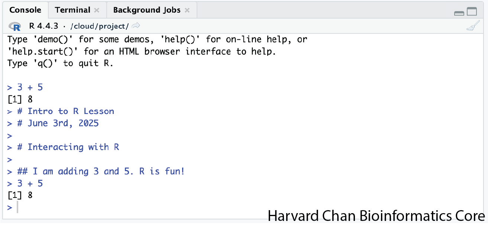

What happens if we do that same command without the comment symbol `#`?
Re-run the command after removing the \# sign in the front:

```{r}
#| label: remove_comment
#| error: true
Add 3 and 5
3 + 5
```

Now R is trying to run that sentence as a command, and it doesn't work.
We get an error in the console.

This means that the R interpreter did not know what to do with that
command. Reintroduce the `#` to re-comment the appropriate line.

### Console command prompt

Interpreting the command prompt can help understand when R is ready to
accept commands. Below lists the different states of the command prompt
and how you can exit a command:

**Console is ready to accept commands**: `>`.

If R is ready to accept commands, the R console shows a `>` prompt.

When the console receives a command (by directly typing into the console
or running from the script editor (`Ctrl-Enter`), R will try to execute
it.

After running, the console will show the results and come back with a
new `>` prompt to wait for new commands.

**Console is waiting for you to enter more data**: `+`.

If R is still waiting for you to enter more data because it isn't
complete yet, the console will show a `+` prompt. It means that you
haven't finished entering a complete command. Often this can be due to
you having not 'closed' a parenthesis or quotation.

**Escaping a command and getting a new prompt**: `ESC`

If you're in Rstudio and you can't figure out why your command isn't
running, you can click inside the console window and press `ESC` to
escape the command and bring back a new prompt `>`.

### Keyboard shortcuts in RStudio

In addition to some of the shortcuts described earlier in this lesson,
we have listed a few more that can be helpful as you work in RStudio.

| key | action |
|--------------------------------|----------------------------------------|
| <kbd>Ctrl</kbd>+<kbd>Enter</kbd> | Run command from the script editor in the console |
| <kbd>ESC</kbd> | Escape the current command to return to the command prompt |
| <kbd>Ctrl</kbd>+<kbd>1</kbd> | Move cursor from console to script editor |
| <kbd>Ctrl</kbd>+<kbd>2</kbd> | Move cursor from script editor to console |
| <kbd>Tab</kbd> | Use this key to complete a file path |
| <kbd>Ctrl</kbd>+<kbd>Shift</kbd>+<kbd>C</kbd> | Comment the block of highlighted text |

::: callout-tip
## **Exercise 2**

Try highlighting only `3 +` from your script editor and running it. Find
a way to bring back the command prompt `>` in the console.
:::

## The R syntax

Now that we know how to talk with R via the script editor or the
console, we want to use R for something more than adding numbers. To do
this, we need to know more about the R syntax.

The main "parts of speech" in R (syntax) include:

-   the **comments** (`#`) and how they are used to document content
-   **variables** and **functions**
-   the **assignment operator** `<-`
-   the `=` for **arguments** in functions

*NOTE: Indentation and consistency in spacing is used to improve clarity
and legibility*

We will go through each of these "parts of speech" in more detail,
starting with the assignment operator.

## Assignment operator

To do useful and interesting things in R, we need to assign *values* to
*variables* using the assignment operator, `<-`. For example, we can use
the assignment operator to assign the value of `3` to `x` by executing:

```{r}
#| label: assign_value_x
# Assign the value of 3 to the object called x
x <- 3
```

The assignment operator (`<-`) assigns **values on the right** to
**variables on the left**.

*In RStudio, typing* <kdb>Alt</kbd> + <kdb>-</kdb> (push <kdb>Alt</kdb>
at the same time as the <kdb>-</kdb> key, on Mac type
<kdb>option</kdb> + <kdb>-</kdb>) will write `<-` in a single keystroke.

### Variables

A variable is a symbolic name for (or reference to) information.
Variables in computer programming are analogous to "buckets", where
information can be maintained and referenced. On the outside of the
bucket is a name. When referring to the bucket, we use the name of the
bucket, not the data stored in the bucket.

In the example above, we created a variable or a "bucket" called `x`.
Inside we put a value, `3`.

Let's create another variable called `y` and give it a value of 5.

```{r}
#| label: assign_value_y
# Assign the value of 5 to the object called y
y <- 5
```

When assigning a value to an variable, R does not print anything to the
console. You can force it to print the value by using parentheses or by
typing the variable name.

```{r}
#| label: print_y
# Print the object y
y
```

You can also view information on the variable by looking in your
`Environment` window in the upper right-hand corner of the RStudio
interface.

::: center
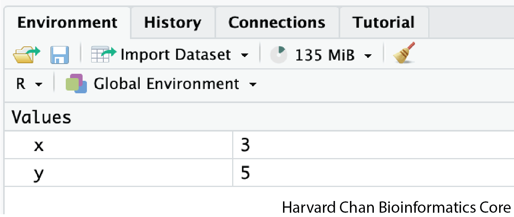
:::

Now we can reference these buckets by name to perform mathematical
operations on the values contained within. What do you get in the
console for the following operation:

```{r}
#| label: add_x_y
# Add x and y
x + y
```

Try assigning the results of this operation to another variable called
`number`.

```{r}
#| label: assign_x_y_sum
# Add x and y and assign their sum to the object called number
number <- x + y
```

::: callout-tip
## **Exercise 3**

Try changing the value of the variable `x` to 5. What happens to
`number`?

Now try changing the value of variable `y` to contain the value 10. What
do you need to do, to update the variable `number`?
:::

### Tips on variable names

Variables can be given almost any name, such as `x`,
`current_temperature`, or `subject_id`. However, there are some rules /
suggestions you should keep in mind:

-   Make your names explicit and not too long.
-   Avoid names starting with a number (`2x` is not valid but `x2` is)
-   Avoid names of fundamental functions in R (e.g., `if`, `else`,
    `for`, see [here](https://statisticsglobe.com/r-functions-list/) for
    a complete list). In general, even if it's allowed, it's best to not
    use other function names (e.g., `c`, `T`, `mean`, `data`) as
    variable names. When in doubt, you can check the "Help" tab to see
    if the name is already in use.
-   Avoid dots (`.`) within a variable name, as in `my.dataset`. There
    are many functions in R with dots in their names for historical
    reasons, but because dots have a special meaning in R (for methods)
    and other programming languages, it's best to avoid them.
-   Use nouns for object names and verbs for function names
-   Keep in mind that **R is case sensitive** (e.g., `genome_length` is
    different from `Genome_length`)
-   Be consistent with the styling of your code (where you put spaces,
    how you name variable, etc.). In R, two popular style guides are
    [Hadley Wickham's style guide](http://adv-r.had.co.nz/Style.html)
    and
    [Google's](http://web.stanford.edu/class/cs109l/unrestricted/resources/google-style.html).

## Interacting with data in R

R is commonly used for handling big data, and so it only makes sense
that we learn about R in the context of some kind of relevant data.
Let's take a few minutes to familiarize ourselves with the data.

### Visualizing the provided files

You can access the files we need for this workshop by clicking on the
`data/` directory within the "Files" tab. Within here, you should find
the four files that we will be working with. Note that the views below
will not be available until we actually "read" the data into the script
in Lesson 03.

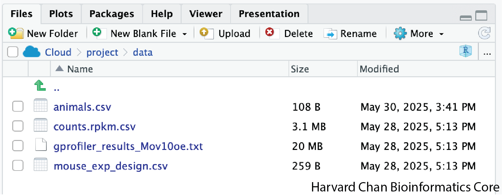

### The dataset

In this example dataset, we have collected whole brain samples from 12
mice and want to evaluate expression differences between them. The
expression data represents normalized count data obtained from
RNA-sequencing of the 12 brain samples. This data is stored in a comma
separated values (CSV) file as a 2-dimensional matrix, with **each row
corresponding to a gene and each column corresponding to a sample**.

::: center
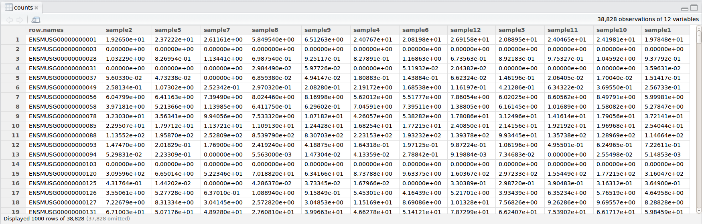
:::

### The metadata

We have another file in which we identify **information about the data**
or **metadata**. Our metadata is also stored in a CSV file. In this
file, each row corresponds to a sample and each column contains some
information about each sample.

The first column contains the row names, and **note that these are
identical to the column names in our expression data file above**
(albeit, in a slightly different order). The next few columns contain
information about our samples that allow us to categorize them. For
example, the second column contains genotype information for each
sample. Each sample is classified in one of two categories: Wt (wild
type) or KO (knockout). *What types of categories do you observe in the
remaining columns?*

::: center
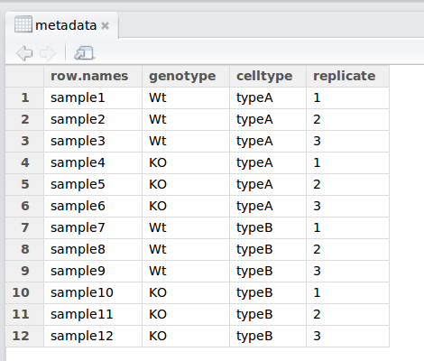
:::

R is particularly good at handling this type of **categorical data**.
Rather than simply storing this information as text, the data ican be
represented in a specific data structure which allows the user to sort
and manipulate the data in a quick and efficient manner. We will discuss
this in more detail as we go through the different lessons in R!

### Additional datasets

There are a handful of additional data sets within the `data` directory
that we will use during this workshop as toy data sets. Some of the
datasets are only used as toy data sets in optional lessons.

### Recommended practices

Before we move on to more complex concepts and getting familiar with the
language, we want to point out a few things about recommended practices
when working with R, which will help you stay organized in the long run:

-   Code and workflows are more reproducible if we can document
    everything that we do. Our end goal is not just to "do stuff", but
    to do it in a way that anyone can easily and exactly replicate our
    workflow and results. **All code should be written in the script
    editor and saved to file, rather than working in the console.**
-   The **R console** should be mainly used to inspect objects, test a
    function or get help.
-   Use `#` signs to comment. **Comment liberally** in your R scripts.
    This will help future you and other collaborators know what each
    line of code (or code block) was meant to do. Anything to the right
    of a `#` is ignored by R. *A shortcut for this is*
    <kbd>Ctrl</kbd>+<kbd>Shift</kbd>+<kbd>C</kbd> if you want to comment
    an entire chunk of text.

# Part 2: Syntax and Data Structures

### Learning Objectives

-   Describe frequently-used data types in R.
-   Construct data structures to store data.

## Data Types

Variables can contain values of specific types within R. The six **data
types** that R uses include:

-   `"numeric"` for any numerical value, including whole numbers and
    decimals. This is the most common data type for performing
    mathematical operations.
-   `"character"` for text values, denoted by using quotes ("") around
    value. For instance, while 5 is a numeric value, if you were to put
    quotation marks around it, it would turn into a character value, and
    you could no longer use it for mathematical operations. Single or
    double quotes both work, as long as the same type is used at the
    beginning and end of the character value.
-   `"integer"` for whole numbers (e.g., `2L`, the `L` indicates to R
    that it's an integer). It behaves similar to the `numeric` data type
    for most tasks or functions; however, it takes up less storage space
    than numeric data, so often tools will output integers if the data
    is known to be comprised of whole numbers. Just know that integers
    behave similarly to numeric values. If you wanted to create your
    own, you could do so by providing the whole number, followed by an
    upper-case L.
-   `"logical"` for `TRUE` and `FALSE` (the Boolean data type). The
    `logical` data type can be specified using four values, `TRUE` in
    all capital letters, `FALSE` in all capital letters, a single
    capital `T` or a single capital `F`.
-   `"complex"` to represent complex numbers with real and imaginary
    parts (e.g., `1+4i`) and that's all we're going to say about them
-   `"raw"` that we won't discuss further

The table below provides examples of each of the commonly used data
types:

|  Data Type |        Examples        |
|-----------:|:----------------------:|
|   Numeric: |     1, 1.5, 20, pi     |
| Character: | "anytext", "5", "TRUE" |
|   Integer: |     2L, 500L, -17L     |
|   Logical: |   TRUE, FALSE, T, F    |

The type of data will determine what you can do with it. For example, if
you want to perform mathematical operations, then your data type cannot
be character or logical. Whereas if you want to search for a word or
pattern in your data, then you data should be of the character data
type. The task or function being performed on the data will determine
what type of data can be used.

## Data Structures

We know that variables are like buckets, and so far we have seen that
bucket filled with a single value. Even when `number` was created, the
result of the mathematical operation was a single value. **Variables can
store more than just a single value, they can store a multitude of
different data structures.** These include, but are not limited to,
vectors (`c`), factors (`factor`), matrices (`matrix`), data frames
(`data.frame`) and lists (`list`).

### Vectors

A vector is the most common and basic data structure in R, and is pretty
much the workhorse of R. It's basically just a collection of values,
mainly either numbers,

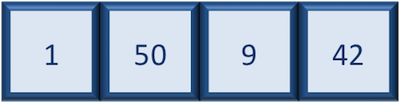

or characters,


or logical values,

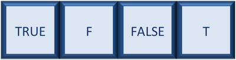

**Note that all values in a vector must be of the same data type.** If
you try to create a vector with more than a single data type, R will try
to coerce it into a single data type.

For example, if you were to try to create the following vector:


R will coerce it into:

::: center
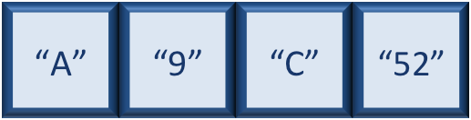
:::

The analogy for a vector is that your bucket now has different
compartments; these compartments in a vector are called *elements*.

Each **element** contains a single value, and there is no limit to how
many elements you can have. A vector is assigned to a single variable,
because regardless of how many elements it contains, in the end it is
still a single entity (bucket).

Let's create a vector of genome lengths and assign it to a variable
called `glengths`.

Each element of this vector contains a single numeric value, and three
values will be combined together into a vector using `c()` (the combine
function). All of the values are put within the parentheses and
separated with a comma.

```{r}
#| label: create_glengths_vector
# Create a numeric vector and store the vector as an object called glengths
glengths <- c(4.6, 3000, 50000)

# Print the contents of glengths
glengths
```

*Note your environment shows the `glengths` variable is numeric (num)
and tells you the `glengths` vector starts at element 1 and ends at
element 3 (i.e. your vector contains 3 values) as denoted by the
\[1:3\].*

A vector can also contain characters. Create another vector called
`species` with three elements, where each element corresponds with the
genome sizes vector (in Mb).

```{r}
#| label: create_species_vector
# Create a character vector and store the vector as an object called species
species <- c("ecoli", "human", "corn")

# Print the contents of species
species
```

What do you think would happen if we forgot to put quotations around one
of the values? Let's test it out with corn.

```{r}
#| label: error_unquoted_string
#| error: true
# What if you forget to put quotes around corn
species <- c("ecoli", "human", corn)
```

Note that RStudio is quite helpful in color-coding the various data
types. We can see that our numeric values are blue, the character values
are green, and if we forget to surround corn with quotes, it's black.
What does this mean? Let's try to run this code.

When we try to run this code we get an error specifying that object
'corn' is not found. What this means is that R is looking for an object
or variable in my Environment called 'corn', and when it doesn't find
it, it returns an error. If we had a character vector called 'corn' in
our Environment, then it would combine the contents of the 'corn' vector
with the values "ecoli" and "human".

Since we only want to add the value "corn" to our vector, we need to
re-run the code with the quotation marks surrounding corn. A quick way
to add quotes to both ends of a word in RStudio is to highlight the
word, then press the quote key.

```{r}
#| label: recreate_species_vector
# Create a character vector and store the vector as an object called species
species <- c("ecoli", "human", "corn")
```

::: callout-tip
# **Exercise 1**

1.  Try to create a vector of numeric and character values by
    *combining* the two vectors that we just created (`glengths` and
    `species`). Assign this combined vector to a new variable called
    `combined`. *Hint: you will need to use the combine `c()` function
    to do this*.

2.  Print the `combined` vector in the console, what looks different
    compared to the original vectors?
:::

### Factors

A **factor** is a special type of vector that is used to **store
categorical data**. Each unique category is referred to as a **factor
level** (i.e. category = level). Factors are built on top of integer
vectors such that each **factor level** is assigned an **integer
value**, creating value-label pairs.

For instance, if we have four animals and the first animal is female,
the second and third are male, and the fourth is female, we could create
a factor that appears like a vector, but has integer values stored
under-the-hood. The integer value assigned is a one for females and a
two for males. The numbers are assigned in alphabetical order, so
because the f- in females comes before the m- in males in the alphabet,
females get assigned a one and males a two. In later lessons we will
show you how you could change these assignments.

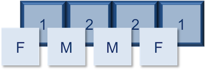

Let's create a factor vector and explore a bit more. We'll start by
creating a character vector describing three different levels of
expression. Perhaps the first value represents expression in mouse1, the
second value represents expression in mouse2, and so on and so forth:

```{r}
#| label: create_expression_vector
# Create a character vector and store the vector as an object called expression
expression <- c("low", "high", "medium", "high", "low", "medium", "high")
```

Now we can convert this character vector into a *factor* using the
`factor()` function:

```{r}
#| label: convert_expression_to_factor
# Turn the expression vector into a factor vector
expression <- factor(expression)
```

So, what exactly happened when we applied the `factor()` function?

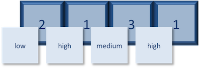

The expression vector is categorical, in that all the values in the
vector belong to a set of categories; in this case, the categories are
`low`, `medium`, and `high`. By turning the expression vector into a
factor, the **categories are assigned integers alphabetically**, with
high=1, low=2, medium=3. This in effect assigns the different factor
levels. You can view the newly created factor variable and the levels in
the **Environment** window.

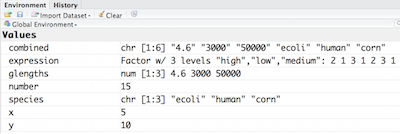

So now that we have an idea of what factors are, when would you ever
want to use them?

Factors are extremely valuable for many operations often performed in R.
For instance, factors can give order to values with no intrinsic order.
In the previous 'expression' vector, if I wanted the low category to be
less than the medium category, then we could do this using factors.
Also, factors are necessary for many statistical methods. For example,
descriptive statistics can be obtained for character vectors if you have
the categorical information stored as a factor. Also, if you want to
denote which category is your base level for a statistical comparison,
then you would need to have your category variable stored as a factor
with the base level assigned to 1. Anytime that it is helpful to have
the categories thought of as groups in an analysis, the factor function
makes this possible. For instance, if you want to color your plots by
treatment type, then you would need the treatment variable to be a
factor.

::: callout-tip
# **Exercise 2**

Let's say that in our experimental analyses, we are working with three
different sets of cells: normal, cells knocked out for geneA (a very
exciting gene), and cells overexpressing geneA. We have three replicates
for each celltype.

1.  Create a vector named `samplegroup` with nine elements: 3 control
    ("CTL") values, 3 knock-out ("KO") values, and 3 over-expressing
    ("OE") values.

2.  Turn `samplegroup` into a factor data structure.
:::

### Matrix

A `matrix` in R is a collection of vectors of **same length and
identical datatype**. Vectors can be combined as columns in the matrix
or by row, to create a 2-dimensional structure.

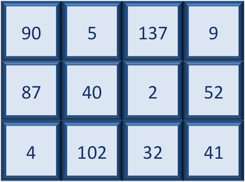

Matrices are used commonly as part of the mathematical machinery of
statistics. They are usually of numeric datatype and used in
computational algorithms to serve as a checkpoint. For example, if input
data is not of identical data type (numeric, character, etc.), the
`matrix()` function will throw an error and stop any downstream code
execution.

### Data Frame

A `data.frame` is the *de facto* data structure for most tabular data
and what we use for statistics and plotting. A `data.frame` is similar
to a matrix in that it's a collection of vectors of the **same length**
and each vector represents a column. However, in a dataframe **each
vector can be of a different data type** (e.g., characters, integers,
factors). In the data frame pictured below, the first column is
character, the second column is numeric, the third is character, and the
fourth is logical.

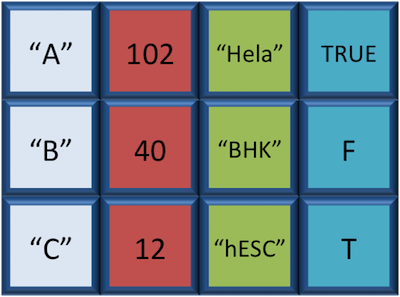

A data frame is the most common way of storing data in R, and if used
systematically makes data analysis easier.

We can create a dataframe by bringing **vectors** together to **form the
columns**. We do this using the `data.frame()` function, and giving the
function the different vectors we would like to bind together. *This
function will only work for vectors of the same length.*

```{r}
#| label: create_df
# Create a data frame and store it as an object called df
df <- data.frame(species, glengths)
```

We can see that a new variable called `df` has been created in our
`Environment` within a new section called `Data`. In the `Environment`,
it specifies that `df` has 3 observations of 2 variables. What does that
mean? In R, rows always come first, so it means that `df` has 3 rows and
2 columns. We can get additional information if we click on the blue
circle with the white triangle in the middle next to `df`. It will
display information about each of the columns in the data frame, giving
information about what the data type is of each of the columns and the
first few values of those columns.

Another handy feature in RStudio is that if we hover the cursor over the
variable name in the `Environment`, `df`, it will turn into a pointing
finger. If you click on `df`, it will open the data frame as it's own
tab next to the script editor. We can explore the table interactively
within this window. To close, just click on the X on the tab.

As with any variable, we can print the values stored inside to the
console if we type the variable's name and run.

```{r}
#| label: print_df
# Print the contents of df
df
```

::: callout-tip
# **Exercise 3**

Create a data frame called `favorite_books` with the following vectors
as columns:

```{r}
#| label: create vectors_for_df
# Create a character vector containing book names and assign it to titles
titles <- c("Catch-22", "Pride and Prejudice", "Nineteen Eighty Four")
# Create a numeric vector containing page numbers and assign it to pages
pages <- c(453, 432, 328)
```
:::

### Bonus material: Lists

Lists are a data structure in R that can be perhaps a bit daunting at
first, but soon become amazingly useful. A list is a data structure that
can hold any number of any types of other data structures.


If you have variables of different data structures you wish to combine,
you can put all of those into one list object by using the `list()`
function and placing all the items you wish to combine within
parentheses:

```{r}
#| label: create_list1
# Create a list holding the objects species, df and number and assign it to an object called list1
list1 <- list(species, df, number)
```

We see `list1` appear within the Data section of our environment as a
list of 3 components or variables. If we click on the blue circle with a
triangle in the middle, it's not quite as interpretable as it was for
data frames.

Essentially, each component is preceded by a colon. The first colon give
the `species` vector, the second colon precedes the `df` data frame,
with the dollar signs indicating the different columns, the last colon
gives the single value, `number`.

If I click on `list1`, it opens a tab where you can explore the contents
a bit more, but it's still not super intuitive. The easiest way to view
small lists is to print to the console.

Let's type list1 and print to the console by running it.

```{r}
#| label: print_list1
# Print the contents of list1
list1
```

There are three components corresponding to the three different
variables we passed in, and what you see is that structure of each is
retained. Each component of a list is referenced based on the number
position. We will talk more about how to inspect and manipulate
components of lists in later lessons.

::: callout-tip
# **Exercise 4**

Create a list called `list2` containing `species`, `glengths`, and
`number`.
:::

Now that we know what lists are, why would we ever want to use them?
When getting started with R, you will most likely encounter lists with
different tools or functions that you use. Oftentimes a tool will need a
list as input, so that all the information needed to run the tool is
present in a single variable. Sometimes a tool will output a list when
working through an analysis. Knowing how to work with them and extract
necessary information will be critically important.

As you become more comfortable with R, you will find yourself using
lists more often. One common use of lists is to make iterative processes
more efficient. For example, let's say you had multiple data frames
containing the same weather information from different cities throughout
North America. You wanted to perform the same task on each of the data
frames, but that would take a long time to do individually. Instead you
could create a list where each data frame is a component of the list.
Then, you could perform the task on the list instead, which would be
applied to each of the components.

# Part 3: Functions and Arguments

```{r}
#| label: load_data
#| echo: false
# Variables needed from previous lessons
glengths <- c(4.6, 3000, 50000)
```

### Learning Objectives

-   Describe and utilize functions in R.
-   Modify default behavior of a function using arguments.
-   Identify R-specific sources of obtaining more information about
    functions.
-   Demonstrate how to create user-defined functions in R

## Functions and their arguments

### What are functions?

A key feature of R is functions. Functions are **"self contained"
modules of code that accomplish a specific task**. Functions usually
take in some sort of data structure (value, vector, dataframe etc.),
process it, and return a result.

The general usage for a function is the name of the function followed by
parentheses:

```{r}
#| label: function_example
#| eval: false
# DO NOT RUN
# Example syntax for using a function
function_name(input)
```

The input(s) are called **arguments**, which can include:

1.  the physical object (any data structure) on which the function
    carries out a task
2.  specifications that alter the way the function operates (e.g.
    options)

Not all functions take arguments, for example:

```{r}
#| label: getwd_example
#| eval: false
# Return the working directory
getwd()
```

However, most functions can take several arguments. If you don't specify
a required argument when calling the function, you will either receive
an error or the function will fall back on using a *default*.

The **defaults** represent standard values that the author of the
function specified as being "good enough in standard cases". An example
would be what symbol to use in a plot. However, if you want something
specific, simply change the argument yourself with a value of your
choice.

### Basic functions

We have already used a few examples of basic functions in the previous
lessons i.e `getwd()`, `c()`, and `factor()`. These functions are
available as part of R's built in capabilities, and we will explore a
few more of these base functions below.

Let's revisit a function that we have used previously to combine data
`c()` into vectors. The *arguments* it takes is a collection of numbers,
characters or strings (separated by a comma). The `c()` function
performs the task of combining the numbers or characters into a single
vector. You can also use the function to add elements to an existing
vector:

```{r}
#| label: adding_elements_to_vector
# Adding 90 to the end of the glengths vector	
glengths <- c(glengths, 90)
# Adding 30 to the beginning of the glengths vector	
glengths <- c(30, glengths)

# Print out the glengths vector
glengths
```

What happens here is that we take the original vector `glengths`
(containing three elements), and we are adding another item to either
end. We can do this over and over again to build a vector or a dataset.

Since R is used for statistical computing, many of the base functions
involve mathematical operations. One example would be the function
`sqrt()`. The input/argument must be a number, and the output is the
square root of that number. Let's try finding the square root of 81:

```{r}
#| label: square_root
# Return the square root of 81
sqrt(81)
```

Now what would happen if we **called the function** (e.g. ran the
function), on a *vector of values* instead of a single value?

```{r}
#| label: square_root_vector
# Return the square root for each value in glengths
sqrt(glengths)
```

In this case the task was performed on each individual value of the
vector `glengths` and the respective results were displayed.

Let's try another function, this time using one that we can change some
of the *options* (arguments that change the behavior of the function),
for example `round`:

```{r}
#| label: round
# Round 3.14159 to the nearest integer
round(3.14159)
```

We can see that we get `3`. That's because the default is to round to
the nearest whole number. **What if we want a different number of
significant digits?** Let's first learn how to find available arguments
for a function.

## Seeking help for functions

The best way of finding out this information is to use the `?` followed
by the name of the function. Doing this will open up the help manual in
the bottom right panel of RStudio that will provide a description of the
function, usage, arguments, details, and examples:

```{r}
#| label: round_help
#| eval: false
# Open up the help page for the round() function
?round
```

Alternatively, if you are familiar with the function but just need to
remind yourself of the names of the arguments, you can use:

```{r}
#| label: args_round
#| eval: false
# Return the names of the arguments for the round() function
args(round)
```

Even more useful is the `example()` function. This will allow you to run
the examples section from the Online Help to see exactly how it works
when executing the commands. Let's try that for `round()`:

```{r}
#| label: example_round
#| eval: false
# Return an example for the round() function
example("round")
```

In our example, we can change the number of digits returned by **adding
an argument**. We can type `digits=2` or however many we may want:

```{r}
#| label: round_digits_example
# Round 3.14159 to the nearest hundredths place
round(3.14159, digits=2)
```

::: callout-note
If you provide the arguments in the exact same order as they are defined
(in the help manual) you don't have to name them:

```{r}
#| label: round_digits_without_argument_label
# Round 3.14159 to the nearest hundredths place
round(3.14159, 2)
```

However, it's usually not recommended practice because it involves a lot
of memorization. In addition, it makes your code difficult to read for
your future self and others, especially if your code includes functions
that are not commonly used. (It's however OK to not include the names of
the arguments for basic functions like `mean`, `min`, etc...). Another
advantage of naming arguments, is that the order doesn't matter. This is
useful when a function has many arguments.
:::

::: callout-tip
# **Exercise 1**

1.  Let's use base R function to calculate **mean** value of the
    `glengths` vector. You might need to search online to find what
    function can perform this task.

2.  Create a new vector `test <- c(1, NA, 2, 3, NA, 4)`. Use the same
    base R function from exercise 1 (with addition of proper argument),
    and calculate mean value of the `test` vector. The output should be
    `2.5`.

3.  Another commonly used base function is `sort()`. Use this function
    to sort the `glengths` vector in **descending** order.
:::

::: callout-note
In R, missing values are represented by the symbol `NA` (not available).
It's a way to make sure that users know they have missing data, and make
a conscious decision on how to deal with it. There are ways to ignore
`NA` during statistical calculation, or to remove `NA` from the vector.
If you want more information related to missing data or `NA` you can [go
to this
page](https://stats.oarc.ucla.edu/r/faq/how-does-r-handle-missing-values/)
(please note that there are many advanced concepts on that page that
have not been covered in class).
:::

### Bonus Material: User-defined Functions

One of the great strengths of R is the user's ability to add functions.
Sometimes there is a small task (or series of tasks) you need done and
you find yourself having to repeat it multiple times. In these types of
situations, it can be helpful to create your own custom function. The
**structure of a function is given below**:

```{r}
#| label: creating_function_label
#| eval: false
# DO NOT RUN
# Example syntax for creating a user-defined function
name_of_function <- function(argument1, argument2) {
    statements or code that does something
    return(something)
}
```

-   First you give your function a name.
-   Then you assign value to it, where the value is the function.

When **defining the function** you will want to provide the **list of
arguments required** (inputs and/or options to modify behaviour of the
function), and wrapped between curly brackets place the **tasks that are
being executed on/using those arguments**. The argument(s) can be any
type of object (like a scalar, a matrix, a dataframe, a vector, a
logical, etc), and it's not necessary to define what it is in any way.

Finally, you can **"return" the value of the object from the function**,
meaning pass the value of it into the global environment. The important
idea behind functions is that objects that are created within the
function are local to the environment of the function -- they don't
exist outside of the function.

Let's try creating a simple example function. This function will take in
a numeric value as input, and return the squared value.

```{r}
#| label: create_square_it_function
# Create a function called square_it which takes the value x as input 
square_it <- function(x) {
    # Squares the value of x and assigns it to the object called square
    square <- x * x
    # Returns the value of square to the console
    return(square)
}
```

Once you run the code, you should see a function named `square_it` in
the Environment panel (located at the top right of Rstudio interface).
Now, we can use this function as any other base R functions. We type out
the name of the function, and inside the parentheses we provide a
numeric value `x`:

```{r}
#| label: use_square_it_function
# Test the square_it function with 5
square_it(5)
```

Pretty simple, right? In this case, we only had one line of code that
was run, but in theory you could have many lines of code to get obtain
the final results that you want to "return" to the user.

::: callout-note
Do I always have to `return()` something at the end of the function?

In the example above, we created a new variable called `square` inside
the function, and then return the value of `square`. If you don't use
`return()`, by default R will return the value of the last line of code
inside that function. That is to say, the following function will also
work.

```{r}
#| label: square_it_function_without_return
# Create a function called square_it which takes the value x as input 
square_it <- function(x) {
   # Squares the value of x and returns the square to the console
   x * x
}
```

However, we **recommend** always using `return` at the end of a function
as the best practice.
:::

We have only scratched the surface here when it comes to creating
functions! We will revisit this in later lessons, but if interested you
can also find more detailed information on this [R-bloggers
site](https://www.r-bloggers.com/how-to-write-and-debug-an-r-function/),
which is where we adapted this example from.

::: callout-tip
# **Exercise 2**

Write a function called `multiply_it`, which takes two inputs: a numeric
value `x`, and a numeric value `y`. The function will return the product
of these two numeric values, which is `x * y`. For example,
`multiply_it(x=4, y=6)` will return output `24`.
:::

# Part 4: Reading-In and Inspection of Data

### Learning Objectives

-   Demonstrate how to read existing data into R
-   Utilize base R functions to inspect data structures

## Reading data into R

### The basics

Regardless of the specific analysis in R we are performing, we usually
need to bring data in for any analysis being done in R, so learning how
to read in data is a crucial component of learning to use R.

Many functions exist to read data in, and the function in R you use will
depend on the file format being read in. Below we have a table with some
examples of functions that can be used for importing some common text
data types (plain text).

| Data type               | Extension | Function       | Package           |
|:------------------------|:----------|:---------------|:------------------|
| Comma separated values  | csv       | `read.csv()`   | utils (default)   |
|                         |           | `read_csv()`   | readr (tidyverse) |
| Tab separated values    | tsv       | `read_tsv()`   | readr             |
| Other delimited formats | txt       | `read.table()` | utils             |
|                         |           | `read_table()` | readr             |
|                         |           | `read_delim()` | readr             |

For example, if we have text file where the columns are separated by
commas (comma-separated values or comma-delimited), you could use the
function `read.csv`. However, if the data are separated by a different
delimiter in a text file (e.g. ":", ";", " ", "\t"), you could use the
generic `read.table` function and specify the delimiter (`sep = " "`) as
an argument in the function.

::: callout-note
The `"\t"` delimiter is shorthand for tab.
:::

In addition to plain text files, you can also import data from software
such as Prism and Excel using functions from different package - we will
cover this in detail next week!

### Metadata

When working with large datasets, you will very likely be working with
"metadata" file which contains the information about each sample in your
dataset.


### The `read.csv()` function

Let's bring in the metadata file we downloaded earlier
(`mouse_exp_design.csv` or `mouse_exp_design.txt`) using the `read.csv`
function.

First, check the arguments for the function using the `?` to ensure that
you are entering all the information appropriately:

```{r}
#| label: read_csv_help
#| eval: false
# Open up the help page for the read.csv() function
?read.csv
```

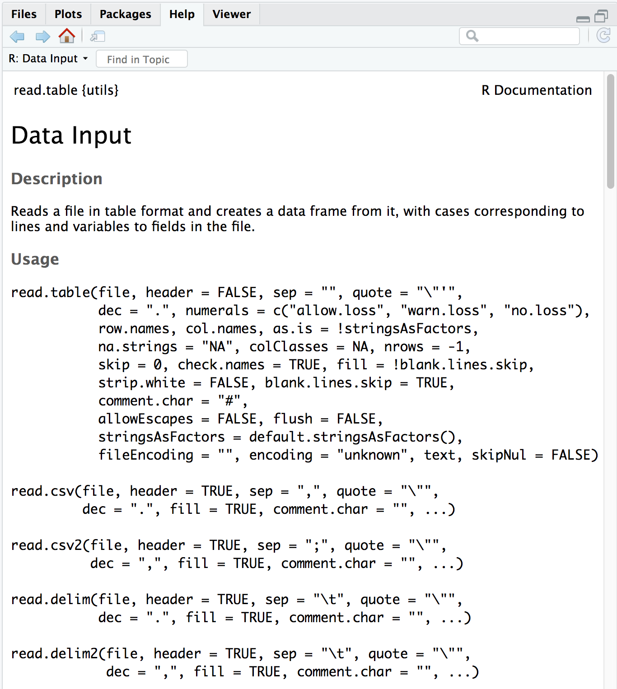

The first thing you will notice is that you've pulled up the
documentation for `read.table()`, this is because that is the parent
function and all the other functions are in the same family.

The next item on the documentation page is the function **Description**,
which specifies that the output of this set of functions is going to be
a **data frame** - "*Reads a file in table format and **creates a data
frame from it**, with cases corresponding to lines and variables to
fields in the file.*"

In usage, all of the arguments listed for `read.table()` are the default
values for all of the family members unless otherwise specified for a
given function. Let's take a look at 2 examples:

1.  **The separator** -
    -   in the case of `read.table()` it is `sep = ""` (space or tab)
    -   whereas for `read.csv()` it is `sep = ","` (a comma).
2.  **The `header`** - This argument refers to the column headers that
    may (`TRUE`) or may not (`FALSE`) exist **in the plain text file you
    are reading in**.
    -   in the case of `read.table()` it is `header = FALSE` (by
        default, it assumes you do not have column names)
    -   whereas for `read.csv()` it is `header = TRUE` (by default, it
        assumes that all your columns have names listed).

***The take-home from the "Usage" section for `read.csv()` is that it
has one mandatory argument, the path to the file and filename in
quotations; in our case that is `data/mouse_exp_design.csv`.***

::: callout-note
# Looking ahead to next session: The `stringsAsFactors` argument

Note that the `read.table {utils}` family of functions has an argument
called `stringsAsFactors`, which by default is set to FALSE (you can
double check this by searching the Help tab for `read.table` or running
`?read.table` in the console).

If `stringsAsFactors = TRUE`, any function in this family of functions
will coerce `character` columns in the data you are reading in to
`factor` columns (i.e., coerce from `vector` to `factor`) in the
resulting data frame.

If you want to maintain the `character vector` data structure (e.g., for
gene names), you will want to make sure that `stringsAsFactors = FALSE`.
:::

### Create a data frame by reading in the file

At this point, please check the extension for the `mouse_exp_design`
file within your `data` folder. You will have to type it accordingly
within the `read.csv()` function.

::: callout-note
`read.csv` is not fussy about extensions for plain text files, so even
though the file we are reading in is a comma-separated value file, it
will be read in properly even with a `.txt` extension.
:::

Let's read in the `mouse_exp_design` file and create a new data frame
called `metadata`.

```{r}
#| label: read_metadata
#| eval: false
# Read in the mouse_exp_design.csv and assign it to metadata
metadata <- read.csv(file="data/mouse_exp_design.csv")
```

::: callout-note
RStudio supports the automatic completion of code using the
<kbd>Tab</kbd> key. This is especially helpful for when reading in files
to ensure the correct file path. The tab completion feature also
provides a shortcut to listing objects, and inline help for functions.
**Tab completion is your friend!** We encourage you to use it whenever
possible.
:::

<br><br> Now the dataset has been imported into your
environment.<br><br>

<hr />

</details>

Go to your Global environment and click on the name of the data frame
you just created.

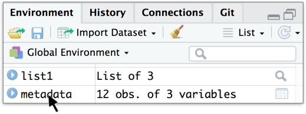

When you do this the metadata table will pop up on the top left hand
corner of RStudio, right next to the R script.

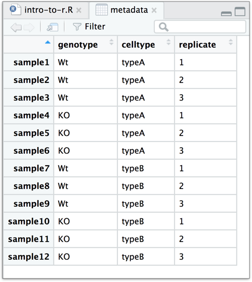

You should see a subtle coloring (blue-gray) of the first row and first
column, the rest of the table will have a white background. This is
because your first row and first columns have different properties than
the rest of the table, they are the names of the rows and columns
respectively.

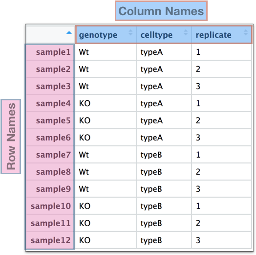

Earlier we noted that the file we just read in had column names (first
row of values) and how `read.csv()` deals with "headers". In addition to
column headers, `read.csv()` also assumes that the first column contains
the row names. Not all functions in the `read.table()` family of
functions will do this and depending on which one you use, you may have
to specify an additional argument to properly assign the row names and
column names.

::: callout-note
Row names and column names are really handy when subsetting data
structures and they are also helpful to identify samples or genes. We
almost always use them with data frames.
:::

::: callout-tip
# **Exercise 1**

1.  Inside your project's `data` folder you should see a file called
    `project-summary.txt`. Read it in to R using `read.table()` with the
    appropriate arguments and store it as the variable `proj_summary`.
    To figure out the appropriate arguments to use with `read.table()`,
    keep the following in mind:
    -   all the columns in the input text file have column name/headers
    -   you want the first column of the text file to be used as row
        names (hint: look up the input for the `row.names =` argument in
        `read.table()`)
2.  Display the contents of `proj_summary` in your console
:::

## Inspecting data structures

There are a wide selection of base functions in R that are useful for
inspecting your data and summarizing it. Let's use the `metadata` file
that we created to test out data inspection functions.

Take a look at the dataframe by typing out the variable name `metadata`
and pressing return; the variable contains information describing the
samples in our study. Each row holds information for a single sample,
and the columns contain categorical information about the sample
`genotype`(WT or KO), `celltype` (typeA or typeB), and
`replicate number` (1,2, or 3).

```{r}
#| label: print_metadata
#| eval: false
# Print out the metadata object
metadata
```

Suppose we had a larger file, we might not want to display all the
contents in the console. Instead we could check the top (the first 6
lines) of this `data.frame` using the function `head()`:

```{r}
#| label: head_metadata
#| eval: false
# Print out the first six lines of the metadata object
head(metadata)
```

### List of functions for data inspection

We already saw how the functions `head()` and `str()` (in the releveling
section) can be useful to check the content and the structure of a
`data.frame`. Below is a non-exhaustive list of functions to get a sense
of the content/structure of data. The list has been divided into
functions that work on all types of objects, some that work only on
vectors/factors (1 dimensional objects), and others that work on data
frames and matrices (2 dimensional objects).

We have some exercises below that will allow you to gain more
familiarity with these. You will definitely be using some of them in the
next few homework sections.

-   **All data structures - content display**:
    -   **`str()`:** compact display of data contents (similar to what
        you see in the Global environment)
    -   **`class()`:** displays the data type for vectors (e.g.
        character, numeric, etc.) and data structure for dataframes,
        matrices, lists
    -   **`summary()`:** detailed display of the contents of a given
        object, including descriptive statistics, frequencies
    -   **`head()`:** prints the first 6 entries (elements for 1-D
        objects, rows for 2-D objects)
    -   **`tail()`:** prints the last 6 entries (elements for 1-D
        objects, rows for 2-D objects)
-   **Vector and factor variables**:
    -   **`length()`:** returns the number of elements in a vector or
        factor
-   **Dataframe and matrix variables**:
    -   **`dim()`:** returns dimensions of the dataset (number_of_rows,
        number_of_columns) \[Note, row numbers will always be displayed
        before column numbers in R\]
    -   **`nrow()`:** returns the number of rows in the dataset
    -   **`ncol()`:** returns the number of columns in the dataset
    -   **`rownames()`:** returns the row names in the dataset\
    -   **`colnames()`:** returns the column names in the dataset

::: callout-tip
# **Exercise 2**

1.  Use the `class()` function on `glengths` and `metadata`, how does
    the output differ between the two?

2.  Use the `summary()` function on the `proj_summary` dataframe, what
    is the median "rRNA_rate"?

3.  How long is the `samplegroup` factor?

4.  What are the dimensions of the `proj_summary` dataframe?

5.  When you use the `rownames()` function on `metadata`, what is the
    *data structure* of the output?

\[Optional\] How many elements in (how long is) the output of
`colnames(proj_summary)`? Don't count, but use another function to
determine this.
:::

# Part 5: Data Manipulation Basics

## Selecting data using indices and sequences

When analyzing data, we often want to **partition the data so that we
are only working with selected columns or rows.** A data frame or data
matrix is simply a collection of vectors combined together. So let's
begin with vectors and how to access different elements, and then extend
those concepts to dataframes.

### Vectors

#### Selecting using indices

If we want to extract one or several values from a vector, we must
provide one or several indices using square brackets `[ ]` syntax. The
**index represents the element number within a vector** (or the
compartment number, if you think of the bucket analogy). R indices start
at 1. Programming languages like Fortran, MATLAB, and R start counting
at 1, because that's what human beings typically do. Languages in the C
family (including C++, Java, Perl, and Python) count from 0 because
that's simpler for computers to do.

Let's start by creating a vector called age:

```{r}
#| label: create_age
# Create a vector with some random ages and assign it to age 
age <- c(15, 22, 45, 52, 73, 81)
```

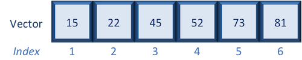

Suppose we only wanted the fifth value of this vector, we would use the
following syntax:

```{r}
#| label: age_fifth
# Extract the fifth value from the age vector
age[5]
```

If we wanted all values except the fifth value of this vector, we would
use the following:

```{r}
#| label: age_all_but_fifth
# Extract all of the values except for the fifth value from the age vector
age[-5]
```

If we wanted to select more than one element we would still use the
square bracket syntax, but rather than using a single value we would
pass in a *vector of several index values*:

```{r}
#| label: age_vector_subset
# Use a nested approach to extract multiple values from the age vector
age[c(3,5,6)]   

# Or create an index vector first for the indices to extract from then age vector
idx <- c(3,5,6) 
# Then extract the ages from the age vector using the index vector
age[idx]
```

To select a sequence of continuous values from a vector, we would use
`:` which is a special function that creates numeric vectors of integer
in increasing or decreasing order. Let's select the *first four values*
from age:

```{r}
#| label: age_sequence_subset
# Extract the first four ages from the age vector
age[1:4]
```

Alternatively, if you wanted the reverse could try `4:1` for instance,
and see what is returned.

::: callout-tip
# **Exercise 1**

1.  Create a vector called `alphabets` with the following letters, C, D,
    X, L, F.

2.  Use the associated indices along with `[ ]` to do the following:

    -   Only display C, D and F
    -   Display all except X
    -   Display the letters in the opposite order (F, L, X, D, C)
:::

#### Selecting using indices with logical operators

We can also use indices with logical operators. Logical operators
include greater than (`>`), less than (`<`), and equal to (`==`). A full
list of logical operators in R is displayed below:

| Operator | Description              |
|:--------:|:-------------------------|
|    \>    | greater than             |
|   \>=    | greater than or equal to |
|    \<    | less than                |
|   \<=    | less than or equal to    |
|    ==    | equal to                 |
|    !=    | not equal to             |
|    &     | and                      |
|    \|    | or                       |

We can use logical expressions to determine whether a particular
condition is true or false. For example, let's use our age vector:

```{r}
#| label: print_age
# Show the age vector
age
```

If we wanted to know if each element in our age vector is greater than
50, we could write the following expression:

```{r}
#| label: age_greater_than_50
# Return a logical vector for values in age greater than 50
age > 50
```

Returned is a vector of logical values the same length as age with TRUE
and FALSE values indicating whether each element in the vector is
greater than 50.

We can use these logical vectors to select only the elements in a vector
with TRUE values at the same position or index as in the logical vector.

Select all values in the `age` vector over 50 **or** `age` less than 18:

```{r}
#| label: age_greater_than_50_less_than_18
# Return a logical vector for values in age greater than 50 or less than 18
age > 50 | age < 18

# Use a nested approach to extract values from the age vector greater than 50 or less than 18
age[age > 50 | age < 18]

# Or create a logical vector for values in age greater than 50 or less than 18
idx <- age > 50 | age < 18
# Then extract the ages from the age vector using the index vector
age[idx]
```

### Indexing with logical operators using the `which()` function

While logical expressions will return a vector of TRUE and FALSE values
of the same length, we could use the `which()` function to output the
indices where the values are TRUE. Indexing with either method generates
the same results, and personal preference determines which method you
choose to use. For example:

```{r}
#| label: age_greater_than_50_less_than_18_which
# Return the indicies for the values in age which are greater than 50 or less than 18
which(age > 50 | age < 18)

# Use a nested approach to extract indicies from the age vector where the values are greater than 50 or less than 18
age[which(age > 50 | age < 18)]

# Or create an index vector for indices from the age vector where the values are greater than 50 or less than 18
idx_num <- which(age > 50 | age < 18)
# Then extract the ages from the age vector using the index vector
age[idx_num]
```

Notice that we get the same results regardless of whether or not we use
the `which()`. Also note that while `which()` works the same as the
logical expressions for indexing, it can be used for multiple other
operations, where it is not interchangeable with logical expressions.

### Dataframes

Dataframes (and matrices) have 2 dimensions (rows and columns), so if we
want to select some specific data from it we need to specify the
"coordinates" we want from it. We use the same square bracket notation
but rather than providing a single index, there are *two indices
required*. Within the square bracket, **row numbers come first followed
by column numbers (and the two are separated by a comma)**. Let's
explore the `metadata` dataframe.

Let's say we wanted to **extract the wild type (`Wt`) value that is
present in the first row and the first column**.

1.  To extract it, just like with vectors, we give the name of the data
    frame that we want to extract from, followed by the square brackets
    (`metadata[ ]`).
2.  Now inside the square brackets we **give the coordinates** or
    indices for the rows in which the value(s) are present, followed by
    a comma, then the coordinates or indices for the columns in which
    the value(s) are present (`metadata[rows, columns]`).

We know the wild type value is in the first row if we count from the
top, so we put a one, then a comma. The wild type value is also in the
first column, counting from left to right, so we put a one in the
columns space too.

```{r}
#| label: subset_metadata_first_row_first_column
# Extract value "Wt" in the first row and first column
metadata[1, 1]
```

Now let's extract the value `1` from the first row and third column.

```{r}
#| label: subset_metadata_first_row_third_column
# Extract value "1" in the first row and third column
metadata[1, 3] 
```

Now if you only wanted to select based on rows, you would provide the
index for the rows and leave the columns index blank. The key here is to
include the comma, to let R know that you are accessing a 2-dimensional
data structure:

```{r}
#| label: subset_metadata_third_row
# Extract third row
metadata[3, ] 
```

What kind of data structure does the output appear to be? We see that it
is two-dimensional with row names and column names, so we can surmise
that it's likely a data frame.

If you were selecting specific columns from the data frame - the rows
are left blank:

```{r}
#| label: subsetset_metadata_third_column
# Extract third column
metadata[ , 3]   
```

Just like with vectors, you can select multiple rows and columns at a
time. Within the square brackets, you need to provide a vector of the
desired values.

We can extract consecutive rows or columns using the colon (`:`) to
create the vector of indices to extract.

```{r}
#| label: subset_metadata_first_two_columns
# Extract the first two columns
metadata[ , 1:2] 
```

Alternatively, we can use the combine function (`c()`) to extract any
number of rows or columns. Let's extract the first, third, and sixth
rows.

```{r}
#| label: subset_metadata_three_columns
# Extract the first, third and sixth rows
metadata[c(1,3,6), ] 
```

For larger datasets, it can be tricky to remember the column number that
corresponds to a particular variable. (Is `celltype` in column 1 or 2?
oh, right... they are in column 1). In some cases, the column/row number
for values can change if the script you are using adds or removes
columns/rows. It's, therefore, often better to use column/row names to
refer to extract particular values, and it makes your code easier to
read and your intentions clearer.

```{r}
#| label: subset_metadata_three_samples_celltype
# Extract the first three samples for the celltype column 
metadata[c("sample1", "sample2", "sample3") , "celltype"] 
```

It's important to type the names of the columns/rows in the exact way
that they are typed in the data frame; for instance if I had spelled
`celltype` with a capital `C`, it would not have worked.

If you need to remind yourself of the column/row names, the following
functions are helpful:

```{r}
#| label: metadata_rownames_colnames
# Check column names of metadata data frame
colnames(metadata)

# Check row names of metadata data frame
rownames(metadata)
```

If only a single column is to be extracted from a data frame, there is
**a useful shortcut available**. If you type the name of the data frame,
then the `$`, you have the option to choose which column to extract. For
instance, let's extract the entire genotype column from our dataset:

```{r}
#| label: subset_metadata_genotype_column
# Extract the genotype column
metadata$genotype 
```

The output will always be a vector, and if desired, you can continue to
treat it as a vector. For example, if we wanted the genotype information
for the first five samples in `metadata`, we can use the square brackets
(`[]`) with the indices for the values from the vector to extract:

```{r}
#| label: subset_first_five_values_genotype_column
# Extract the first five values of the genotype column
metadata$genotype[1:5]
```

Unfortunately, there is no equivalent `$` syntax to select a row by
name.

::: callout-tip
# **Exercise 1**

1.  Return a data frame with only the `genotype` and `replicate` column
    values for `sample2` and `sample8`.

2.  Return the fourth and ninth values of the `replicate` column.

3.  Extract the `replicate` column as a data frame.
:::

#### Selecting using indices with logical operators

With data frames, similar to vectors, we can use logical expressions to
extract the rows or columns in the data frame with specific values.
First, we need to determine the indices in a rows or columns where a
logical expression is `TRUE`, then we can extract those rows or columns
from the data frame.

For example, if we want to return only those rows of the data frame with
the `celltype` column having a value of `typeA`, we would perform two
steps:

1.  Identify which rows in the celltype column have a value of `typeA`.
2.  Use those TRUE values to extract those rows from the data frame.

To do this we would extract the column of interest as a vector, with the
first value corresponding to the first row, the second value
corresponding to the second row, so on and so forth. We use that vector
in the logical expression. Here we are looking for values to be equal to
`typeA`, so our logical expression would be:

```{r}
#| label: metadata_celltype_conditional
# Determine which values in the celltype column of metadata match "typeA"
metadata$celltype == "typeA"
```

This will output TRUE and FALSE values for the values in the vector. The
first six values are `TRUE`, while the last six are `FALSE`. This means
the first six rows of our metadata have a vale of `typeA` while the last
six do not. We can save these values to a variable, which we can call
whatever we would like; let's call it `logical_idx`.

```{r}
#| label: assign_to_index_metadata_celltype_conditional
# Create a logical vector  for which values in the celltype column of metadata match "typeA"
logical_idx <- metadata$celltype == "typeA"
```

Now we can use those `TRUE` and `FALSE` values to extract the rows that
correspond to the `TRUE` values from the metadata data frame. We will
extract as we normally would a data frame with `metadata[ , ]`, and we
need to make sure we put the `logical_idx` in the row's space, since
those `TRUE` and `FALSE` values correspond to the ROWS for which the
expression is `TRUE`/`FALSE`. We will leave the column's space blank to
return all columns.

```{r}
#| label: subset_metadata_by_logical_index
# Subset the metadata data frame for the rows returning TRUE for "typeA" in the celltype column 
metadata[logical_idx, ]
```

##### Selecting indices with logical operators using the `which()` function

As you might have guessed, we can also use the `which()` function to
return the indices for which the logical expression is TRUE. For
example, we can find the indices where the `celltype` is `typeA` within
the `metadata` dataframe:

```{r}
#| label: which_metadata_celltype_conditional
# Return the row numbers for the rows returning TRUE for "typeA" in the celltype column 
which(metadata$celltype == "typeA")
```

This returns the values one through six, indicating that the first 6
values or rows are true, or equal to typeA. We can save our indices for
which rows the logical expression is true to a variable we'll call idx,
but, again, you could call it anything you want.

```{r}
#| label: assign_to_index_which_metadata_celltype_conditional
# Create an index of row numbers for the rows returning TRUE for "typeA" in the celltype column 
idx <- which(metadata$celltype == "typeA")
```

Then, we can use these indices to indicate the rows that we would like
to return by extracting that data as we have previously, giving the
`idx` as the rows that we would like to extract, while returning all
columns:

```{r}
#| label: subset_metadata_by_index
# Subset the metadata data frame for the rows returning TRUE for "typeA" in the celltype column 
metadata[idx, ]
```

Let's try another subsetting. Extract the rows of the metadata data
frame for only the replicates 2 and 3. First, let's create the logical
expression for the column of interest (`replicate`):

```{r}
#| label: which_replicate_greater
# Return the row numbers for the rows returning TRUE for being greater than 1 in the replicate column 
which(metadata$replicate > 1)
```

This should return the indices for the rows in the `replicate` column
within `metadata` that have a value of 2 or 3. Now, we can save those
indices to a variable and use that variable to extract those
corresponding rows from the `metadata` table.

```{r}
#| label: assign_to_index_which_replicate_greater
# Create an index of row numbers for the rows returning TRUE for being greater than 1 in the replicate column 
idx <- which(metadata$replicate > 1)

# Subset the metadata data frame for the rows returning TRUE for being greater than 1 in the replicate column 
metadata[idx, ]
```

Alternatively, instead of doing this in two steps, we could use nesting
to perform in a single step:

```{r}
#| label: nested_which_replicate_greater
# Subset the metadata data frame for the rows returning TRUE for being greater than 1 in the replicate column 
metadata[which(metadata$replicate > 1), ]
```

Either way works, so use the method that is most intuitive for you.

So far we haven't stored as variables any of the extractions/subsettings
that we have performed. Let's save this output to a variable called
`sub_meta`:

```{r}
#| label: reassign_nested_which_replicate_greater
# Subset the metadata data frame for the rows returning TRUE for being greater than 1 in the replicate column and assign it to sub_meta
sub_meta <- metadata[which(metadata$replicate > 1), ]
```

::: callout-tip
# **Exercise 2**

Subset the `metadata` dataframe to return only the rows of data that do
NOT have a genotype of `KO`.
:::

::: callout-note
There are easier methods for subsetting **dataframes** using logical
expressions, including the `filter()` and the `subset()` functions.
These functions will return the rows of the dataframe for which the
logical expression is TRUE, allowing us to subset the data in a single
step. We will explore the `filter()` function in more detail in a later
lesson.
:::

::: callout-note
# An R package for data wrangling

The methods presented above are using base R functions for data
wrangling. Later we will explore the **Tidyverse suite of packages**,
specifically designed to make data wrangling easier.
:::
